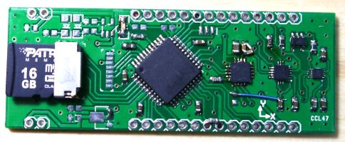

## Meduza

Miniature control/logger board. Part of the Naut /nøyːt/ project.

### PCB v1

[Schematic](eagle/meduza01/meduza01.pdf)

#### Features
 * Microchip PIC24/dsPIC33 microcontroller
 * microSD card socket (up-to 32GB)
 * IRDA transceiver (2 Mibit/s)
 * 3D Magnetometer [MAG3110L](http://cache.freescale.com/files/sensors/doc/data_sheet/MAG3110.pdf)
 * 3D Accelerometer (MMA8452QL)
 * 3D Giro (L3G4200D)
 * temperature sensor (MCP9800)
 * analog/digital IO for externals sensors
 * Inductive charging circuitry
 * 1-cell LiPo battery
