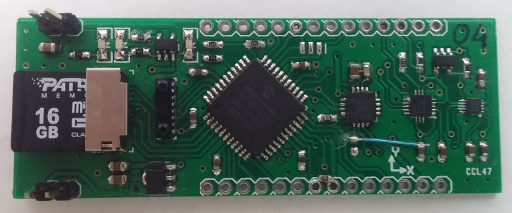

## Prototypes

### v1.03

* [PIC24FJ32GA004](http://ww1.microchip.com/downloads/en/DeviceDoc/39881e.pdf) - [3003h Errata](http://ww1.microchip.com/downloads/en/DeviceDoc/80000470h.pdf)

### v1.04

* [PIC24FJ32GA004](http://ww1.microchip.com/downloads/en/DeviceDoc/39881e.pdf) - [3003h Errata](http://ww1.microchip.com/downloads/en/DeviceDoc/80000470h.pdf)
* IRDA transceiver (2 Mibit/s) [TFDU6300](http://media.digikey.com/pdf/Data%20Sheets/Vishay%20Semiconductors/TFDU6300.pdf)
* 3D Magnetometer [MAG3110L](http://cache.freescale.com/files/sensors/doc/data_sheet/MAG3110.pdf)
* 3D Accelerometer [MMA8452QL](http://cache.freescale.com/files/sensors/doc/data_sheet/MMA8452Q.pdf)
* 3D Giro [L3G4200D](http://www.st.com/web/en/resource/technical/document/datasheet/CD00265057.pdf)
* temperature sensor [MCP9800](http://www.microchip.com/mymicrochip/filehandler.aspx?ddocname=en021183)
* 1-cell LiPo battery PMIC [MCP73831T](http://www.microchip.com/mymicrochip/filehandler.aspx?ddocname=en025112)
* microSD card socket (up-to 32GB)

### v1.05

* [PIC24FJ64GA004](http://ww1.microchip.com/downloads/en/DeviceDoc/39881e.pdf) - new
* IRDA transceiver (2 Mibit/s) [TFDU6300](http://media.digikey.com/pdf/Data%20Sheets/Vishay%20Semiconductors/TFDU6300.pdf)
* -
* 3D Accelerometer [MMA8452QL](http://cache.freescale.com/files/sensors/doc/data_sheet/MMA8452Q.pdf)
* -
* -
* -
* microSD card socket (up-to 32GB)

### v1.06

* [PIC24FJ32GA004](http://ww1.microchip.com/downloads/en/DeviceDoc/39881e.pdf) - [3003h Errata](http://ww1.microchip.com/downloads/en/DeviceDoc/80000470h.pdf)
